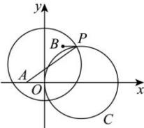

> [!faq]- 全练一本通解析
> **【答案】** C
>
> **【解析】**
> 解析: 假设圆 C 上存在点 P, 设 $P(x,y)$ ,
> 圆 C 的方程可化为 $(x-2)^{2}+y^{2}=4$ ，圆心为 $(2,0)$ . $\left|PA\right|^{2}+\left|PB\right|^{2}=\left(x+1\right)^{2}+\left(y-0\right)^{2}+\left(x-1\right)^{2}+\left(y-2\right)^{2}=12$ 即 $x^{2} + y^{2} - 2y - 3 = 0$ 即 $x^{2} + (y - 1)^{2} = 4$ ，表示圆，圆心为 $(0,1)$ .
> 因为 $\left|2-2\right|<\sqrt{\left(2-0\right)^{2}+\left(0-1\right)^{2}}<2+2$ 所以为圆 $(x-2)^{2}+y^{2}=4$ 与圆 $x^{2}+(y-1)^{2}=4$ 位置关系为相交，故点 P 有 2 个. 故选：C.
> 
