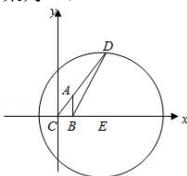

> [!faq]- 全练一本通解析
> **【解析】**
> 10
> 解析:以 C 为原点,以直线 CB 为 x 轴建立平面坐标系,
> 设 $B(2,0)$ , $D(x,y)$ , $\because \overrightarrow{CD}=3\overrightarrow{CA}$ , $\therefore A(\frac{x}{3},\frac{y}{3})$ . $\because AB^{2}+AC^{2}=20$ $\therefore(\frac{x}{3}-2)^{2}+\frac{y^{2}}{9}+\frac{x^{2}}{9}+\frac{y^{2}}{9}=20$ $\therefore(x-3)^{2}+y^{2}=81$ ∴ D 在以 E(3,0)，以 r=9 为半径的圆 E 上，
> ∴ BD 的最大距离为 BE + r = 10.
> 故答案为:10.
> 
