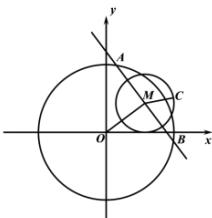

> [!faq]- 全练一本通解析
> **【答案】** BC
>
> **【解析】**
> 解析: 因为点 $M(4,3)$ 为 AB 的中点，∴ $OM \perp AB$ ， $|OM| = \sqrt{4^2 + 3^2} = 5$ ，
> 所以 $\left|AM\right|=\left|BM\right|=\sqrt{49-5^{2}}=2\sqrt{6}$ ∵ $AC^{2} + BC^{2} = 66$ ，∴ $\overrightarrow{AC}^{2} + \overrightarrow{BC}^{2} = 66$ 则 $\left(\overrightarrow{AM}+\overrightarrow{MC}\right)^{2}+\left(\overrightarrow{BM}+\overrightarrow{MC}\right)^{2}=66$ 即 $\overrightarrow{AM}^{2}+2\overrightarrow{AM}\cdot\overrightarrow{MC}+\overrightarrow{MC}^{2}+\overrightarrow{BM}^{2}+2\overrightarrow{BM}\cdot\overrightarrow{MC}+\overrightarrow{MC}^{2}=66$ 因为 $\overrightarrow{AM} = -\overrightarrow{BM}$ ，则可得 $2\overrightarrow{AM}^{2} + 2\overrightarrow{MC}^{2} = 66$ ，可解得 $\left|MC\right| = 3$ ，
> 所以点 C 构成的图象是以 M 为圆心，3 为半径的圆，故 A 错误，B 正确；
> 所以可得 OC 的最小值为 $\left|OM\right|-3=5-3=2$ ，故 C 正确，D 错误.
> 故选: BC.
> 
