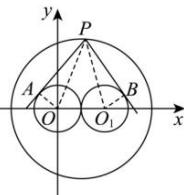

> [!faq]- 全练一本通解析
> **【解析】**
> $\sqrt{15}$
> 解析：
> 
> 如图, 连接 $PO, PO_1, OA, O_1B$ , 因为 $PA$ , $PB$ 与圆相切, 所以 $|PO|^2 + |PO_1|^2 = |PA|^2 + |OA|^2 + |PB|^2 + |O_1B|^2 = 18 + 1 + 1 = 20$ , 设 $P(x,y)$ , 所以 $x^2 + y^2 + (x - 2)^2 + y^2 = 2x^2 + 2y^2 - 4x + 4 = 20$ , 整理得 $(x - 1)^2 + y^2 = 9$ , 所以 $P$ 在以 (1,0) 为圆心, 3 为半径的圆上运动, $\left|PA\right| = \sqrt{\left|PO\right|^2 - 1} \leq \sqrt{4^2 - 1} = \sqrt{15}$ , 当且仅当 $P$ 在 (4,0) 时等号成立, 所以答案为: $\sqrt{15}$ .
