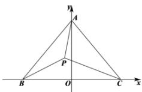

> [!faq]- 全练一本通解析
> **【答案】** B
>
> **【解析】**
> 解析:以 BC 的中点为坐标原点, BC 所在直线为 x 轴, 建立直角坐标系设 $B(-a,0)$ , $C(a,0)$ , $(a>0)$ , 则 $A(0,\sqrt{3-a^{2}})$ 设 $P(x,y)$ ，由 $PB^{2} + PC^{2} = 3PA^{2} = 3$ 得 $\left(x+a\right)^{2}+y^{2}+\left(x-a\right)^{2}+y^{2}=3\left[x^{2}+\left(y-\sqrt{3-a^{2}}\right)^{2}\right]=3$ 即 $x^{2}+y^{2}=\frac{3}{2}-a^{2}$ , $x^{2}+\left(y-\sqrt{3-a^{2}}\right)^{2}=1$ 即点 P 既在 $(0,0)$ 为圆心， $\sqrt{\frac{3}{2}-a^{2}}$ 为半径的圆上，又在 $(0,\sqrt{3-a^{2}})$ 为圆心，1 为半径的圆上
> 可得 $\left|1-\sqrt{\frac{3}{2}-a^{2}}\right|\leq\sqrt{3-a^{2}}\leq1+\sqrt{\frac{3}{2}-a^{2}}$ ，由两边平方化简可得 $a^{2}\leq\frac{23}{16}$ 则 $\Delta ABC$ 的面积为 $S=\frac{1}{2}\cdot2a\cdot\sqrt{3-a^{2}}=a\sqrt{3-a^{2}}=\sqrt{-\left(a^{2}-\frac{3}{2}\right)^{2}+\frac{9}{4}}$ 由 $a^{2}\leq\frac{23}{16}$ ，可得 $a^{2}=\frac{23}{16}$ ，S 取得最大值，且为 $\frac{5\sqrt{23}}{16}$ . 故选：B.
> 
