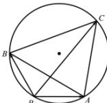

> [!faq]- 全练一本通解析
> **【解析】**
> $$
> \frac {2 \sqrt {2 1}}{3}
> $$
> 解析：设 $\vec{a} = \overrightarrow{PA}$ ， $\vec{b} = \overrightarrow{PB}$ ， $\vec{c} = \overrightarrow{PC}$ ，由 $|\vec{a}| = 1$ ， $|\vec{b}| = 2$ ，且 $\vec{a}\cdot \vec{b} = -1$ ，可得 $\cos \left\langle \vec{a},\vec{b}\right\rangle = \frac{-1}{2\times 1} = -\frac{1}{2}$ ， $\angle APB = 120^{\circ}$ ，因为向量 $\vec{a} -\vec{c}$ ， $\vec{b} -\vec{c}$ 的夹角为 $60^{\circ}$ ，即 $\angle ACB = 60^{\circ}$ ，所以点 $C$ 在优弧 $\widehat{AB}$ 上运动，故 $|\vec{c} |$ 的最大值是 $\triangle ABC$ 的外接圆的直径，可算得 $AB = \sqrt{4 + 1 - 2\times 2\times 1\times\left(-\frac{1}{2}\right)} = \sqrt{7}$ ，由正弦定理，直径 $2R = \frac{\sqrt{7}}{\sin 120^{\circ}} = \frac{2\sqrt{21}}{3}$ 故 $|\vec{c} |$ 的最大值是 $\frac{2\sqrt{21}}{3}$
> 
> $$
> \frac {2 \sqrt {2 1}}{3}
> $$
