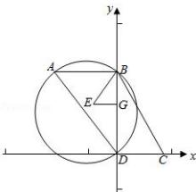

> [!faq]- 全练一本通解析
> **【答案】** A
>
> **【解析】**
> 解析:根据题意,建立如图的坐标系,则 $D(0,0)$ , $C(9,0)$ , $B(0,16)$ ,
> BD 中点为 G，则 $G(0,8)$ 设 ABD 三点都在圆 E 上, 其半径为 R,
> 在 RtΔADB 中, 由正弦定理可得 $\frac{a}{\sin A} = \frac{16}{\frac{4}{5}} = 2R = 20$ , 即 R = 10,
> 即 EB = 10, BG = 8, 则 EG = 6,
> 则 E 的坐标为 $(-6,8)$ ,
> 故点 A 在以点 E(-6,8) 为圆心, 10 为半径的圆上,
> 当且仅当 C、E、A 三点共线时，AC 取得最大值，此时 $AC=10+EC=27$ ; 故选：A.
> 
