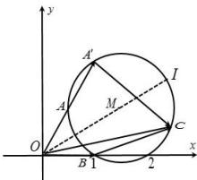

> [!faq]- 全练一本通解析
> **【答案】** A
>
> **【解析】**
> 解析: 因为 $\left|\vec{a}\right|=\left|\vec{b}\right|=2\vec{a}\cdot\vec{b}=1$ ，所以 $2\left|\vec{a}\right|\cdot\left|\vec{b}\right|\cos\left\langle\vec{a}\cdot\vec{b}\right\rangle=1$ ，可得 $\cos\left\langle\vec{a}\cdot\vec{b}\right\rangle=\frac{1}{2}$ 因为 $0^{\circ}\leq\left\langle\vec{a}\cdot\vec{b}\right\rangle\leq180^{\circ}$ ，所以 $\left\langle\vec{a}\cdot\vec{b}\right\rangle=60^{\circ}$ 如图所示: 在平面直角坐标系中， $A\left(\frac{1}{2},\frac{\sqrt{3}}{2}\right)$ ， $B(1,0)$ 不妨设 $\overrightarrow{OA}=\overrightarrow{a}$ ， $\overrightarrow{OB}=\overrightarrow{b}$ ，延长 OA 到 $OA'$ 使得 $OA=AA'$ ，则 $\overrightarrow{OA'}=2\overrightarrow{a}$ ，点 C 为平面直角坐标系中的点， $\overrightarrow{OC}=\overrightarrow{c}$ ，则 $\overrightarrow{c}-2\overrightarrow{a}=\overrightarrow{A'C}$ ， $\overrightarrow{c}-\overrightarrow{b}=\overrightarrow{BC}$ ，则满足题意时， $\angle ACB=60^{\circ}$ ，结合点 $A'$ ，B 为定点，且 $\left|A'B\right|=\sqrt{3}$ ，由正弦定理可得： $\frac{A'B}{\sin60^{\circ}}=2R$ ，可得 R=1，
> 则点 C 的轨迹是以 $M\left(\frac{3}{2},\frac{\sqrt{3}}{2}\right)$ 为圆心，1 为半径的优弧上，
> 当 C,M,O 三点共线，即点 C 位于图中点 I 位置时， $\left|\vec{c}\right|$ 取得最大值，
> 其最大值为 $\left|OM\right|+R=\sqrt{\left(\frac{3}{2}\right)^{2}+\left(\frac{\sqrt{3}}{2}\right)^{2}}+1=\sqrt{3}+1$ 故选:A.
> 
