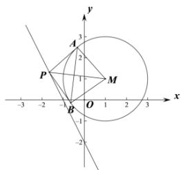

> [!faq]- 全练一本通解析
> **【解析】**
> $$
> 4; 2 x + y + 1 = 0
> $$
> 解析: 由 $x^{2} + y^{2} - 2x - 2y - 2 = 0$ 可得 $(x - 1)^{2} + (y - 1)^{2} = 4$ ，则圆心 $M(1,1)$ ，半径为 2，
> 如图, 连接 AM, BM，四边形 PAMB 的面积为 $\frac{1}{2}|PM|\cdot|AB|$ ，要使 $|PM|\cdot|AB|$ 最小，则需四边形 PAMB 的面积最小，
> 即只需 $\triangle PAM$ 的面积最小，因为 $|AM|=2$ ，所以只需 $|PA|$ 最小，又 $|PA|=\sqrt{|PM|^{2}-|AM|^{2}}=\sqrt{|PM|^{2}-4}$ 所以只需直线 $2x + y + 2 = 0$ 上的动点 P 到点 M 的距离最小，其最小值是圆心到直线的距离 $d=\frac{\left|2+1+2\right|}{\sqrt{5}}=\sqrt{5}$ ，此时 $PM \perp l, |PA| = 1$ ，
> 则此时四边形 PAMB 的面积为 2，即 $|PM|\cdot|AB|$ 的最小值为 4，
> 则直线 PM 的方程为 $x-2y+1=0$ ，由 $\left\{\begin{aligned}&2x+y+2=0\\&x-2y+1=0\end{aligned}\right.$ ，解得 $\left\{\begin{aligned}&x=-1\\&y=0\end{aligned}\right.$ ，即 $P(-1,0)$ ,
> 点 P, A, M, B 四点共圆，所以以 PM 为直径的圆的方程为 $x^{2}+\left(y-\frac{1}{2}\right)^{2}=\left(\frac{\sqrt{5}}{2}\right)^{2}$ ，即 $x^{2}+y^{2}-y-1=0$ ，
> 联立方程 $\left\{\begin{aligned}x^{2}+y^{2}-2x-2y-2=0\\x^{2}+y^{2}-y-1=0\end{aligned}\right.$ 可得直线 AB 方程为 $2x+y+1=0$ .
> 故答案为:4; $2x + y + 1 = 0$ .
> 
