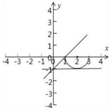

> [!faq]- 全练一本通解析
> **【答案】** $[0,1]$
>
> **【解析】**
> 曲线 $y = -\sqrt{1 - (x - 2)^{2}}$ 表示圆心为 $(2,0)$ ，半径为 1 的 x 轴下方的半圆，直线 y = kx - 1 为恒过 $(0, -1)$ 点的直线系，根据题意画出图形，如图所示：
> 
> 则直线与圆有公共点时，倾斜角的取值范围是 $[0,1]$ 。
