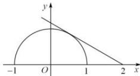

> [!faq]- 全练一本通解析
> **【答案】** $\left(-\frac{\sqrt{3}}{3}, 0\right]$
>
> **【解析】**
> 分别作出 $y=\sqrt{1-x^{2}}$ 与 $y=k(x-2)$ 的图象, 如下:
> 
> 当 $y=\sqrt{1-x^{2}}$ 与 $y=k(x-2)$ 的图象相切时， $\frac{|2k|}{\sqrt{k^{2}+1}}=1$ ，即 $k=\pm\frac{\sqrt{3}}{3}$ ，
> 由图可知 k<0，故相切时 $k=-\frac{\sqrt{3}}{3}$ ，
> 因此结合图象可知，当 $-\frac{\sqrt{3}}{3}<k\leq0$ 时， $y=\sqrt{1-x^{2}}$ 与 $y=k(x-2)$ 的图象有两个不同的交点。故答案为： $\left(-\frac{\sqrt{3}}{3},0\right]$ .
