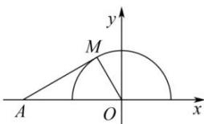

> [!faq]- 全练一本通解析
> **【解析】**
> $\left[0,\frac{\sqrt{3}}{3}\right]$ 解析: 设函数 $f(x)=\frac{\sqrt{1-x^{2}}}{x+2}$ ，令 $y=\sqrt{1-x^{2}}$ ，则点 $M(x,y)$ 位于一个单位圆 x 轴的上半部分，如图所示。
> 将函数 $f(x)=\frac{\sqrt{1-x^{2}}}{x+2}$ 改写为 $f(x)=\frac{y-0}{x-(-2)}$ ，则表示定点 $A(-2,0)$ 与点 $M(x,y)$ 所连直线 MA 的斜率。
> 当直线 MA 与上半单位圆相切时，在直角三角形 MOA
> 中，MO=1, OA=2, ∴MAO=30°，所以 $k_{MA}=\tan30^{\circ}=\frac{\sqrt{3}}{3}$ . 又 $k_{AO}=0$ ，所以 $f(x)\in\left[0,\frac{\sqrt{3}}{3}\right]$ . 即函数 $y=\frac{\sqrt{1-x^{2}}}{x+2}$ 的值域为 $\left[0,\frac{\sqrt{3}}{3}\right]$ .
> 
