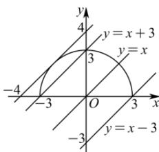

> [!faq]- 全练一本通解析
> **【解析】**
> $-3\leq m <   3$ 或 $m = 3\sqrt{2}$
> 解析: 因为方程 $\sqrt{9-x^{2}}=x+m$ 有且只有一个根,
> 所以函数 $y = \sqrt{9 - x^2}$ 与函数 $y = x + m$ 的图象有且只有一个交点，
> 
> 作出函数的图象, 结合图象可知,
> 显然 $-3 \leq m < 3$ 时符合题意，
> 当直线与半圆相切时，则 $O$ 到直线距离为3，即 $\frac{|m|}{\sqrt{1 + 1}} = 3$ ，可得 $m = 3\sqrt{2}$ 或 $m = -3\sqrt{2}$ （舍），综上， $-3\leq m <   3$ 或 $m = 3\sqrt{2}$ .故答案为： $-3\leq m <   3$ 或 $m = 3\sqrt{2}$
