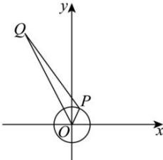

> [!faq]- 全练一本通解析
> **【解析】**
> 14
> 解析： $\left|z+5-12i\right|=\left|z-(-5+12i)\right|$ 记 $z = a + bi (a, b \in \mathbb{R})$ ，对应点为 $P(a, b)$ ， $-5 + 12i$ 对应点为 $Q(-5, 12)$ ，复平面原点为 $O(0, 0)$ ，
> 由 $|z|=1$ 可知，点 P 在单位圆 $x^{2} + y^{2} = 1$ 上，
> 由复数减法的几何意义可知， $\left|z+5-12i\right|$ 表示点 P, Q 的距离，
> 易知， $\left|OQ\right|-1\leq\left|PQ\right|\leq\left|OQ\right|+1$ 因为 $\left|OQ\right|=\sqrt{\left(-5\right)^{2}+12^{2}}=13$ 所以 $12 \leq |PQ| \leq 14$ ，故 $\left|z+5-12i\right|$ 的最大值为 14。故答案为：14
> 
