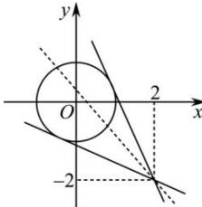

> [!faq]- 全练一本通解析
> **【解析】**
> $\left[\frac{-4 - \sqrt{7}}{3},\frac{-4 + \sqrt{7}}{3}\right]$
> 解析： $y=\frac{\sin x+2}{\cos x-2}$ 表示点 $(\cos x,\sin x)$ 与点 $(2,-2)$ 连线的斜率， $\because(\cos x,\sin x)$ 的轨迹为圆 $x^{2}+y^{2}=1$ $\therefore y=\frac{\sin x+2}{\cos x-2}$ 表示圆 $x^{2}+y^{2}=1$ 上的点与点 $(2,-2)$ 连线的斜率,
> 
> 由图象可知: 过 $(2,-2)$ 作圆 $x^{2}+y^{2}=1$ 的切线, 斜率必然存在,
> 则设过 $(2,-2)$ 的圆 $x^{2}+y^{2}=1$ 的切线方程为 $y+2=k(x-2)$ ，即
> kx-y-2k-2=0，
> ∴ 圆心 $(0,0)$ 到切线的距离 $d=\frac{\left|-2k-2\right|}{\sqrt{k^{2}+1}}=1$ ，解得： $k=\frac{-4\pm\sqrt{7}}{3}$ 结合图象可知: 圆 $x^{2} + y^{2} = 1$ 上的点与点 $(2, -2)$ 连线的斜率的取值范围为 $\left[\frac{-4-\sqrt{7}}{3}, \frac{-4+\sqrt{7}}{3}\right]$ ,
> 即 $y=\frac{\sin x+2}{\cos x-2}$ 的值域为 $\left[\frac{-4-\sqrt{7}}{3},\frac{-4+\sqrt{7}}{3}\right]$ .
> 故答案为： $\left[\frac{-4-\sqrt{7}}{3},\frac{-4+\sqrt{7}}{3}\right]$ .
