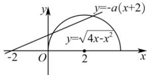

> [!faq]- 全练一本通解析
> **【解析】**
> $\left(-\frac{\sqrt{3}}{3},0\right]$ 解析: 方程 $ax + 2a + \sqrt{4x - x^{2}} = 0$ 有两个不相等的实数根等价于 $\sqrt{4x-x^{2}}=-a(x+2)$ 有两个实数根，
> 设 $y=\sqrt{4x-x^{2}},y\geq0,y=-a(x+2)$ ,
> 故 $y=\sqrt{4x-x^{2}},y\geq0$ 的图象与 $y=-a(x+2)$ 的图象有两个不同的交点，
> 又 $y=\sqrt{4x-x^{2}},y\geq0$ 可化为 $(x-2)^{2}+y^{2}=4(y\geq0)$ ,
> 故 $y=\sqrt{4x-x^{2}},y\geq0$ 的图象为如图所示的半圆，
> 
> 半圆的圆心为 $(2,0)$ ，半径为 $2$ ，故圆心到直线的距离 $\frac{|4a|}{\sqrt{a^2 + 1}} < 2$ ，故 $-\frac{\sqrt{3}}{3} < a < \frac{\sqrt{3}}{3}$ ，而直线 $y = -a(x + 2)$ 需在 $x$ 轴的上方或与 $x$ 轴重合，故 $-a \geq 0$ ，故 $a \in \left(-\frac{\sqrt{3}}{3}, 0\right]$ ，
