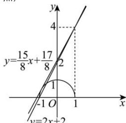

> [!faq]- 全练一本通解析
> **【答案】** $(\frac{15}{8}, 2]$ .
>
> **【解析】**
> 令 $f(x) = \sqrt{1 - x^2} - k(x - 1) - 4 = 0$ ，则 $\sqrt{1 - x^2} - k(x - 1) - 4 = 0$ ，所以 $\sqrt{1 - x^2} = k(x - 1) + 4$ ，又因为 $y = \sqrt{1 - x^2} \geq 0$ ，即为 $x^2 + y^2 = 1 (y \geq 0)$ ，表示单位圆位于 $x$ 轴上及上方部分；而 $y = k(x - 1) + 4$ ，表示过点(1,4)且斜率为 $k$ 的直线，所以将问题转化为半圆 $x^2 + y^2 = 1 (y \geq 0)$ 与直线 $y = k(x - 1) + 4$ 有两个交点，
> 
> 当直线与半圆相切时； $\frac{|4-k|}{\sqrt{1+k^{2}}}=1$ ，解得 $k=\frac{15}{8}$ ，
> 当直线过点 $(-1,0)$ 时，则有 $-2k+4=0$ ，解得 k=2，综上， $k\in(\frac{15}{8},2]$ .
> 故答案为： $(\frac{15}{8},2]$ .
