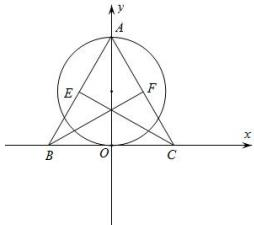

> [!faq]- 全练一本通解析
> **【解析】**
> 解析: 以 BC 的中点 O 为坐标原点, BC 所在直线为 x 轴, OA 所在直线为 y 轴, 建立如图所示的平面直角坐标系.
> 设 $\triangle ABC$ 的边长为 4, 则 $B(-2,0)$ , $C(2,0)$ , $A(0,2\sqrt{3})$ , $E(-1,\sqrt{3})$ , $F(1,\sqrt{3})$ , $\overrightarrow{BE}=(1,\sqrt{3})$ , $\overrightarrow{CF}=(-1,\sqrt{3})$ 设 $P(x,y)$ ，则 $\overrightarrow{PE}=\left(-1-x,\sqrt{3}-y\right)$ ， $\overrightarrow{PF}=\left(1-x,\sqrt{3}-y\right)$ ，
> 由 $\overrightarrow{PE}\cdot\overrightarrow{PF}=\overrightarrow{BE}\cdot\overrightarrow{CF}$ 得 $(-1-x,\sqrt{3}-y)\cdot(1-x,\sqrt{3}-y)=(1,\sqrt{3})\cdot(-1,\sqrt{3})$ 所以 $x^{2}+\left(y-\sqrt{3}\right)^{2}=3$ ，即点 P 的轨迹是以 $(0,\sqrt{3})$ 为圆心， $\sqrt{3}$ 为半径的圆，也就是以 AO 为直径的圆，易知该圆与 $\triangle ABC$ 的三边有 4 个公共点.
> 
