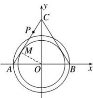

> [!faq]- 全练一本通解析
> **【解析】**
> $\left(\frac{3}{8}, \frac{1}{2}\right]$ 解析：如图，以 $AB$ 的中点 $O$ 为坐标原点， $AB$ ， $OC$ 所在直线为 $x$ 轴、 $y$ 轴，建立平面直角坐标系，则 $A(-1,0), B(1,0)$ ，
> 设 $P(x,y)$ . 则 $\overline{PA} \cdot \overline{PB} - 2\lambda + 1 = 0$ ，
> 即为 $(-1 - x)(1 - x) + y^2 - 2\lambda + 1 = 0$ ，化简得 $x^2 + y^2 = 2\lambda (\lambda > 0)$ ，
> 故所有满足 $\overline{PA} \cdot \overline{PB} - 2\lambda + 1 = 0$ 的点 $P$ 在以 $O$ 为圆心， $\sqrt{2\lambda}$ 为半径的圆上.
> 过点 $O$ 作 $OM \perp AC$ ，垂足为点 $M$ ，由题意知，线段 $AC$ 与圆 $x^2 + y^2 = 2\lambda$ 有两个交点，所以 $|OM| < \sqrt{2\lambda} \leqslant |OA|$ ，
> 即 $\frac{\sqrt{3}}{2} < \sqrt{2\lambda} \leqslant 1$ ，解得 $\frac{3}{8} < \lambda \leqslant \frac{1}{2}$ .
> 
