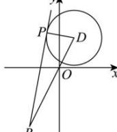

> [!faq]- 全练一本通解析
> **【答案】** C
>
> **【解析】**
> $$
> P (x, y)
> $$
> $$
> \overrightarrow {P O} = (- x, - y), \overrightarrow {P A} = (2 - x, 4 - y)
> $$
> $$
> \overrightarrow {P O} \cdot \overrightarrow {P A} = - x (2 - x) - y (4 - y) = - 1
> $$
> $$
> x ^ {2} - 2 x + y ^ {2} - 4 y + 1 = 0
> $$
> 化为 $(x-1)^{2}+(y-2)^{2}=4$ ，则点 P 的轨迹为以 $D(1,2)$ 为圆心，半径为 2 的圆，
> $$
> k _ {O B} = \frac {- 4}{- 2} = 2 = k _ {O D} = \frac {4}{2}
> $$
> $$
> B, O, D \text {三点}
> $$
> 
> 显然当直线 $PB$ 与此圆相切时， $\tan \angle PBO$ 的值最大.
> 又 $BD = \sqrt{3^2 + 6^2} = 3\sqrt{5}, PD = 2$ ，
> 则 $PB = \sqrt{BD^2 - PD^2} = \sqrt{45 - 4} = \sqrt{41}$ ，
> 则 $\tan \angle PBO = \frac{PD}{PB} = \frac{2}{\sqrt{41}} = \frac{2\sqrt{41}}{\sqrt{41}}$ .
>
> 故选 **C**.
