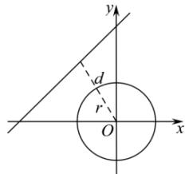

> [!faq]- 全练一本通解析
> **【答案】** 1
>
> **【解析】**
> 因为点 $A(-t,0)(t > 0)$ ， $B(t,0)$ ，点 $C$ 满足 $\overrightarrow{AC} \cdot \overrightarrow{BC} = 8$ ，
> 设 $C(x_0, y_0)$ ，
> 则 $\overrightarrow{AC} = (x_0 + t, y_0), \overrightarrow{BC} = (x_0 - t, y_0), \overrightarrow{AC} \cdot \overrightarrow{BC} = 8 \Rightarrow x_0^2 + y_0^2 = 8 + t^2$ 所以点 C 是以原点 $O(0,0)$ 为圆心，半径 $r=\sqrt{8+t^{2}}$ 的圆，
> 
> 而 $O(0,0)$ 到直线 $l:3x-4y+24=0$ 的距离 $d=\frac{24}{5}>\frac{9}{5}$ ,
> 因为点 C 到直线 $l:3x-4y+24=0$ 的最小距离为 $\frac{9}{5}$ ,
> 所以 $\frac{24}{5}-r=\frac{9}{5}\Rightarrow r=\sqrt{8+t^{2}}=3,(t>0)\Rightarrow t=1$ . 故答案为：1
