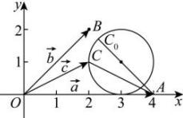

> [!faq]- 全练一本通解析
> **【答案】** 详见解析
>
> **【解析】**
> $\sqrt{2} + 1$
> 
> 设 $\overrightarrow{OA} = \overrightarrow{a}, \overrightarrow{OB} = \overrightarrow{b}, \overrightarrow{OC} = \overrightarrow{c}$ ，以 OA 所在的直线为 x 轴，O 为坐标原点建立平面直角坐标系（如图），
> 因 $|\vec{a}| = 4, |\vec{b}| = 2\sqrt{2}, \langle\vec{a}, \vec{b}\rangle = \frac{\pi}{4}$ ，则 $A(4,0), B(2,2)$ ，设 $C(x,y)$ ，
> 由 $(\vec{c} - \vec{a}) \cdot (\vec{c} - \vec{b}) = -1$ 可
> 得： $(x - 4, y) \cdot (x - 2, y - 2) = (x - 4)(x - 2) + y(y - 2) = -1$ 即 $x^{2} + y^{2} - 6x - 2y + 9 = 0$ ，整理得： $(x - 3)^{2} + (y - 1)^{2} = 1$ ，
> ∴ 点 C 在以 (3,1) 为圆心，1 为半径的圆上，
> 则 $|\vec{c} - \vec{a}|$ 表示点 A, C 的距离，即圆上的点与 $A(4,0)$ 的距离，∵ 圆心到点 A 的距离为 $\sqrt{2}$ ，∴ $|\vec{c} - \vec{a}|$ 的最大值为 $\sqrt{2} + 1$ 。
> 故答案为： $\sqrt{2} + 1$ 。
