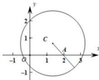

> [!faq]- 全练一本通解析
> **【答案】** 1
>
> **【解析】**
> 因为 $\forall x \in R, \left|\vec{a} - x\vec{b}\right| \geq \left|\vec{a} - \frac{1}{4}\vec{b}\right|, \left|\vec{a}\right| = 2, \vec{a} \cdot \vec{b} = 4$ ,
> 所以 $4+x^{2}\vec{b}^{2}-8x\geq4+\frac{1}{16}\vec{b}^{2}-2,\vec{b}\neq\vec{0},\therefore\left(x^{2}-\frac{1}{16}\right)\vec{b}^{2}-8x+2\geq0$ 所以 $\vec{b}^{2}x^{2}-8x+2-\frac{1}{16}\vec{b}^{2}\geq0$ 对任意 x 都恒成立，
> 所以 $\Delta=64+\frac{1}{4}|\vec{b}|^{4}-8|\vec{b}|^{2}\leq0,\therefore(\frac{1}{2}|\vec{b}|^{2}-8)^{2}\leq0,\therefore\frac{1}{2}|\vec{b}|^{2}=8,\therefore|\vec{b}|=4.$ 不妨设 $\vec{a}=(2,0),\vec{b}=(m,n),\therefore2m=4,\therefore m=2,$ 又 $|\vec{b}|=4,\therefore4+n^{2}=16,\therefore n=\pm2\sqrt{3}.$ 当 $\vec{b}=(2,2\sqrt{3})$ ，设 $\vec{c}=(x,y)$ ，
> 所以 $\begin{pmatrix}\vec{a}-\vec{c}\end{pmatrix}=(2-x,-y),\begin{pmatrix}\vec{b}-2\vec{c}\end{pmatrix}=(2-2x,2\sqrt{3}-2y)$ ，
> 所以 $(2-x)(2-2x)+(-y)(2\sqrt{3}-2y)=6$ 所以 $(x-\frac{3}{2})^{2}+(y-\frac{\sqrt{3}}{2})^{2}=4$ 所以 $\vec{c}$ 对应的点的轨迹是以 $(\frac{3}{2},\frac{\sqrt{3}}{2})$ 为圆心，以 2 为半径的圆，所以 $\left|\vec{a}-\vec{c}\right|=\sqrt{(x-2)^{2}+(y-0)^{2}}$ 可以看成是 $(x,y)$ 到 $(2,0)$ 的距离，
> 所以 $\left|\vec{a}-\vec{c}\right|$ 的最小值为 $2-\sqrt{\left(\frac{3}{2}-2\right)^{2}+\left(\frac{\sqrt{3}}{2}-0\right)^{2}}=2-1=1$ 当 $\vec{b}=(2,-2\sqrt{3})$ 时，同理可得 $\left|\vec{a}-\vec{c}\right|$ 的最小值为 1.
> 
