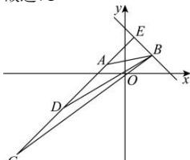

> [!faq]- 全练一本通解析
> **【解析】**
> 
> $$
> 2 x + y - 1 1 = 0
> $$
> $$
> 6 x - 5 y - 9 = 0
> $$
> 解析：（1）解：因为 $\triangle ABC$ 的顶点 $B(5,1)$ ，且 $AB$ 边上的高所在的直线方程为 $x - 2y - 5 = 0$ ，可得 $AB$ 边所在直线的斜率为 $k = -2$ ，所以 $AB$ 所在直线的方程为 $y - 1 = -2(x - 5)$ ，即 $2x + y - 11 = 0$ 。（2）解：因为 $BC$ 边上的中线所在直线的方程为 $2x - y - 5 = 0$ ，联立方程组 $\left\{ \begin{array}{l} 2x + y - 11 = 0 \\ 2x - y - 5 = 0 \end{array} \right.$ ，解得 $x = 4, y = 3$ ，即点 $A(4,3)$ ，设点 $C(x_1, y_1)$ ，则 $BC$ 的中点在直线 $2x - y - 5 = 0$ ，所以 $2 \times \frac{x_1 + 5}{2} - \frac{y_1 + 1}{2} - 5 = 0$ ，即 $2x_1 - y_1 - 1 = 0$ ，即点 $C$ 在直线 $2x - y - 1 = 0$ 上，又由点 $C$ 在直线 $x - 2y - 5 = 0$ 上，联立方程组 $\left\{ \begin{array}{l} x - 2y - 5 = 0 \\ 2x - y - 1 = 0 \end{array} \right.$ ，解得 $x = -1, y = -3$ ，即 $C(-1, -3)$ ，所以 $k_{AC} = \frac{-3 - 3}{-1 - 4} = \frac{6}{5}$ ，所以直线 $AC$ 的方程为 $6x - 5y - 9 = 0$ 。
