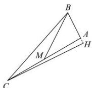

> [!faq]- 全练一本通解析
> **【答案】** （1）（3,5）（2） $21x + 24y + 43 = 0$
>
> **【解析】**
> （1） $CH$ 所在的直线方程为 $x - 2y - 5 = 0$ ，则直线斜率 $k_{CH} = \frac{1}{2}$ ，由 $AB \perp CH$ ，得 $k_{AB} = -2$ 。 $\therefore AB$ 边所在直线方程为 $y - 1 = -2(x - 5)$ ，整理得 $2x + y - 11 = 0$ 。 $\therefore \left\{ \begin{array}{l} 2x + y - 11 = 0 \\ 2x - y - 1 = 0 \end{array} \right.$ ，解得 $\left\{ \begin{array}{l} x = 3 \\ y = 5 \end{array} \right.$ ，所以点 $B$ 的坐标为 (3,5)。
> 
> （2）设 $C(x_{0},y_{0})$ ，M 为 AC 中点，则 $M\left(\frac{x_{0}+5}{2},\frac{y_{0}+1}{2}\right)$ . $\therefore\left\{\begin{aligned}&x_{0}-2y_{0}-5=0\\ &2\times\frac{x_{0}+5}{2}-\frac{y_{0}+1}{2}-1=0\end{aligned}\right.$ ，解得 $\left\{\begin{aligned}&x_{0}=-\frac{19}{3}\\ &y_{0}=-\frac{17}{3}\end{aligned}\right.$ $\therefore C\left(-\frac{19}{3},-\frac{17}{3}\right)$ ，则 BC 中点为 $\left(-\frac{5}{3},-\frac{1}{3}\right)$ , $\therefore k_{BC}=\frac{8}{7}$ ，BC 垂直平分线的斜率为 $k=-\frac{7}{8}$ ，
> BC 垂直平分线的方程为 $y+\frac{1}{3}=-\frac{7}{8}\left(x+\frac{5}{3}\right)$ ，整理得 $21x+24y+43=0$ 。
