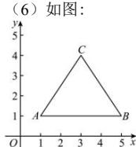

> [!faq]- 全练一本通解析
> **【答案】** 详见解析
>
> **【解析】**
> （1） $y - 3 = 3(x + 2)$ （2） $y + 2 = -\sqrt{3}(x + 4)$ （3） $y + 1 = 0$
> $$
> y - \sqrt {5} = \frac {\sqrt {3}}{3} (x - \sqrt {3})
> $$
> $$
> y + 3 = \sqrt {3} (x - 2)
> $$
> $$
> y - 1 = - \sqrt {3} (x - 5)
> $$
> $$
> y - y _ {0} = k \left(x - x _ {0}\right)
> $$
> $$
> y - 3 = 3 (x + 2)
> $$
> $$
> \frac {2 \pi}{3}
> $$
> $$
> k = \tan \frac {2 \pi}{3} = - \sqrt {3}
> $$
> $$
> y + 2 = - \sqrt {3} (x + 4)
> $$
> (3) 经过点 $C(-1,-1)$ ，与 x 轴平行，所以斜率为 0，所以方程为 $y+1=0$ 。
> （4）直线 $y=\sqrt{3}x+1$ 的斜率为 $\sqrt{3}$ ，倾斜角为 $\frac{\pi}{3}$ ，
> 所以所求直线的倾斜角为 $\frac{\pi}{6}$ ，斜率为 $\frac{\sqrt{3}}{3}$ ，
> 由直线过点 $(\sqrt{3},\sqrt{5})$ ，则直线的点斜式方程为 $y-\sqrt{5}=\frac{\sqrt{3}}{3}(x-\sqrt{3})$ .
> （5）因为直线 $y = \frac{1}{\sqrt{3}} x$ 的斜率为 $\frac{1}{\sqrt{3}} = \frac{\sqrt{3}}{3}$ ，所以该直线倾斜角为 $30^{\circ}$ ，所以所求直线的倾斜角为 $60^{\circ}$ ，其斜率为 $\sqrt{3}$ ，所以所求直线的点斜式方程为 $y + 3 = \sqrt{3}(x - 2)$ .
> (6) 如图:
> 
> 因为 $B=60^{\circ}$ ，所以 $k_{BC}=\tan(180^{\circ}-60^{\circ})=\tan120^{\circ}=-\sqrt{3}$ ，故直线 BC 的点斜式方程为 $y-1=-\sqrt{3}(x-5)$ .
