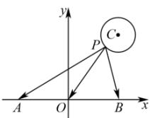

<!-- question-source:start -->
【42】（2024·上海闵行高三练习）在平面直角坐标系 $xOy$ 中，已知 $P$ 是圆 $C: (x - 3)^2 + (y - 4)^2 = 1$ 上的动点，若 $A(-a,0), B(a,0), a \neq 0$ ，则 $\left|\overrightarrow{PA} + \overrightarrow{PB}\right|$ 的最小值为 \_\_\_\_.

<!-- question-source:end -->

![[Q00007194A1]]
