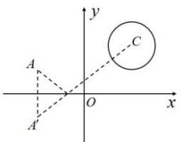

> [!faq]- 全练一本通解析
> **【解析】**
> 4
> 解析:由题意可得圆心 $C(2,2)$ ，半径 r=1，点 $A(-2,1)$ 关于 x 轴的对称点 $A'(-2,-1)$ ，
> 如图：
> 
> 所以 $\left|A^{\prime}C\right|=\sqrt{(2+2)^{2}+\left(2+1\right)^{2}}=5$
> 因此最短路径的长 $\left|A^{\prime}C\right|-r=5-1=4$ 。故答案为：4。
