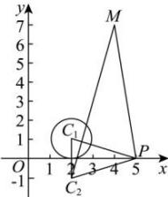

> [!faq]- 全练一本通解析
> **【答案】** $$ 3 2 ] 5 \sqrt {2} - 1 $$
>
> **【解析】**
> 如图,由题意,
> 
> $\left|PQ\right|$ 的最小值是 $\left|PC_1\right| - r = \left|PC_1\right| - 1$
> 所以 $\left|PM\right| + \left|PQ\right|$ 的最小值即为求 $\left|PM\right| + \left|PC_{1}\right| - 1$ 的最小值，
> $$
> C _ {1} (2, 1)
> $$
> $$
> \text { 于 } x
> $$
> $$
> C _ {2} (2, - 1)
> $$
> 则 $\left|PC_1\right| = \left|PC_2\right|$ ，当 $M,P,C_2$ 三点共线时， $\left|PM\right| + \left|PC_2\right|$ 最小，
> 所以 $\left|PM\right| + \left|PC_{1}\right| = \left|PM\right| + \left|PC_{2}\right| \geq \left|MC_{2}\right|$ ，即此时 $\left|PM\right| + \left|PC_{1}\right| - 1$ 的值最小，
> $$
> \left| P M \right| + \left| P Q \right|
> $$
> $$
> \left| M C _ {2} \right| - 1 = 5 \sqrt {2} - 1
> $$
> 故答案为: $5 \sqrt{2} - 1$
