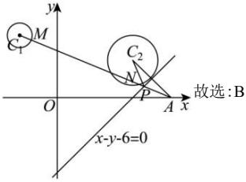

> [!faq]- 全练一本通解析
> **【答案】** B
>
> **【解析】**
> 解析： $C_1:(x + 3)^2 +(y - 5)^2 = 1$ 的圆心为 $C_1(-3,5)$ ，半径 $r_1 = 1$ ， $C_2:(x - 6)^2 +(y - 3)^2 = 4$ 的圆心为 $C_2(6,3)$ ，半径 $r_2 = 2$ 如图所示， $\left|PM\right| + \left|PN\right|$ 的最小值为 $\left|PC_1\right| + \left|PC_2\right| - r_1 - r_2 = \left|PC_1\right| + \left|PC_2\right| - 3$ 的最小值，设点 $C_2(6,3)$ 关于直线 $x - y - 6 = 0$ 的对称点为 $A(m,n)$
> 则 $\left\{\begin{aligned}\frac{6+m}{2}-\frac{n+3}{2}-6=0\\ \frac{n-3}{m-6}\cdot1=-1\end{aligned}\right.$ ，解得 $\left\{\begin{aligned}m=9\\ n=0\end{aligned}\right.$
> 故 $A(9,0)$ ，连接 $AC_{1}$ ，则 $\left|AC_{1}\right|$ 即为 $\left|PC_{1}\right| + \left|PC_{2}\right|$ 的最小值，
> $$
> \left| P C _ {1} \right| + \left| P C _ {2} \right|
> $$
> $$
> \sqrt {(- 3 - 9) ^ {2} + (5 - 0) ^ {2}} = 1 3
> $$
> 故 $\left|PM\right|+\left|PN\right|$ 的最小值为13-3=10.
> 
