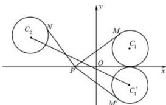

> [!faq]- 全练一本通解析
> **【答案】** B
>
> **【解析】**
> 解析: 圆 $C_{1}$ 关于 x 轴的对称圆的圆心坐标 $C_{1}^{\prime}(2,-1)$ ，半径为 1，圆 $C_{2}$ 的圆心坐标为 $C_{2}(-3,2)$ ，半径为 1，
> ∴ 若 $M^{\prime}$ 与 M 关于 x 轴对称，则 $\left|PM^{\prime}\right|=\left|PM\right|$ ，即 $\left|PM\right|+\left|PN\right|=\left|PM^{\prime}\right|+\left|PN\right|$ 当 $P,M^{\prime},C_{1}^{\prime}$ 三点不共线时， $\left|PM^{\prime}\right|>\left|PC_{1}^{\prime}\right|-1$ 当 $P,M^{\prime},C_{1}^{\prime}$ 三点共线时， $\left|PM^{\prime}\right|=\left|PC_{1}^{\prime}\right|-1$ 所以 $\left|PM^{\prime}\right|\geq\left|PC_{1}^{\prime}\right|-1$ 同理 $\left|PN\right|\geq\left|PC_{2}\right|-1$ （当且仅当 $P,N,C_{2}$ 时取得等号）
> 所以 $\left|PM^{\prime}\right|+\left|PN\right|\geq\left|PC_{1}^{\prime}\right|+\left|PC_{2}\right|-2$ 当 $P,C_{1}^{\prime},C_{2}$ 三点共线时， $\left|PC_{1}^{\prime}\right|+\left|PC_{2}\right|=\left|C_{1}^{\prime}C_{2}\right|$ 当 $P,C_{1}^{\prime},C_{2}$ 三点不共线时， $\left|PC_{1}^{\prime}\right|+\left|PC_{2}\right|>\left|C_{1}^{\prime}C_{2}\right|$ 所以 $\left|PC_{1}^{\prime}\right|+\left|PC_{2}\right|\geq\left|C_{1}^{\prime}C_{2}\right|$ ∴ $\left|PM\right|+\left|PN\right|$ 的最小值为圆 $C_{1}^{\prime}$ 与圆 $C_{2}$ 的圆心距减去两个圆的半径和，
> ∴ $\left|C_{1}^{\prime}C_{2}\right|-1-1=\sqrt{\left(-3-2\right)^{2}+\left(2+1\right)^{2}}-2=\sqrt{34}-2$ 。故选：B.
> 
