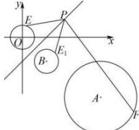
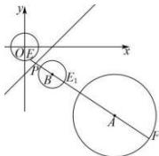

> [!faq]- 全练一本通解析
> **【答案】** D
>
> **【解析】**
> 解析:如图所示,
> 
> 圆 $(x-6)^{2}+(y+5)^{2}=9$ 的圆心为 $A(6,-5)$ ，半径为3，
> 圆 $x^{2}+y^{2}=1$ 关于直线 y=x-2 的对称圆为圆 B，其中设圆心 B 坐标为 $(m,n)$ ，则 $\left\{\begin{aligned}\frac{n}{m}&=-1\\ \frac{n}{2}&=\frac{m}{2}-2\end{aligned}\right.$ ，解得： $\left\{\begin{aligned}m&=2\\ n&=-2\end{aligned}\right.$ 故圆 B 的圆心为 $(2,-2)$ ，半径为 1，
> 由于此时圆心 A 与圆心 B 的距离为： $\left|AB\right|=\sqrt{(6-2)^{2}+\left[-5-(-2)\right]^{2}}=5$ ，
> 大于两圆的半径之和，所以两圆相离，此时 E 点的对称点为 $E_{i}$ ，且 $\left|PE_{i}\right|=\left|PE\right|$ ，所以 $\left|PF\right|-\left|PE\right|=\left|PF\right|-\left|PE_{i}\right|$ ，在 P 点运动过程中，当
> P, B, A, $E_{i}$ , F 五点共线时，且 $E_{i}$ 在圆 B 左侧，点 F 在圆 A 右侧
> 时， $\left|PF\right|-\left|PE_{1}\right|$ 最大，最大值为 $E_{1}F=E_{1}B+BA+AF=1+5+3=9$
> 
> 故选:D.
