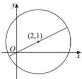

> [!faq]- 全练一本通解析
> **【解析】**
> $14-6\sqrt{5}$
> 解析: 方程 $x^{2} + y^{2} - 4x - 2y - 4 = 0$ 可化为 $(x - 2)^{2} + (y - 1)^{2} = 9$ ，所以 $(x, y)$ 是以 $(2, 1)$ 为圆心，半径为 3 的圆上的点，
> (0,0)与(2,1)的距离是 $\sqrt{2^2 + 1^2} = \sqrt{5}$
> 所以 $x^{2} + y^{2}$ 的最小值是 $\left(3 - \sqrt{5}\right)^2 = 14 - 6\sqrt{5}$ . 故答案为: $14 - 6\sqrt{5}$
> 
