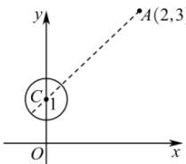

> [!faq]- 全练一本通解析
> **【答案】** $\left[2\sqrt{2} -\frac{1}{2},2\sqrt{2} +\frac{1}{2}\right]$
>
> **【解析】**
> 如图所示,
> $\sqrt{(x-2)^{2}+(y-3)^{2}}$ 可以看成圆 $x^{2}+(y-1)^{2}=\frac{1}{4}$ 上的点 $P(x,y)$ 到点 $A(2,3)$ 的距离.
> 圆心 $C(0,1)$ 到点 $A(2,3)$ 的距离 $d = \sqrt{(0 - 2)^2 + (1 - 3)^2} = 2\sqrt{2}$ .
> 
> 由图可知, 圆上的点 $P(x,y)$ 到 $A(2,3)$ 的距离的取值范围是
> $$
> \left[ 2 \sqrt {2} - \frac {1}{2}, 2 \sqrt {2} + \frac {1}{2} \right]
> $$
> 即 $\sqrt{(x - 2)^2 + (y - 3)^2}$ 的取值范围是 $\left[2\sqrt{2} -\frac{1}{2},2\sqrt{2} +\frac{1}{2}\right]$
