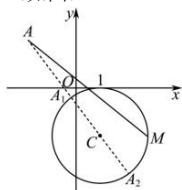

> [!faq]- 全练一本通解析
> **【解析】**
> 49
> 解析: 因为 $(x-1)^{2}+(y+2)^{2}=4$ 表示以 $C(1,-2)$ 为圆心, 半径 r=2 的圆, 所以 $\sqrt{(x+2)^{2}+(y-2)^{2}}$ 表示圆上的动点 $M(x,y)$ 与定点 $A(-2,2)$ 的距离（如图）.
> 
> 连接 $AC$ ，直线 $AC$ 与圆 $C$ 交于 $A_{1}, A_{2}$
> 因为 $\left|AC\right|=\sqrt{(1+2)^{2}+(-2-2)^{2}}=5$
> 则当 $M$ 位于 $A_{2}$ 位置时， $\sqrt{(x + 2)^2 + (y - 2)^2}$ 取得最大值，为
> $\left|AC\right| + r = 5 + 2 = 7$ ；所以 $(x + 2)^{2} + (y - 2)^{2}$ 的最大值为49.
