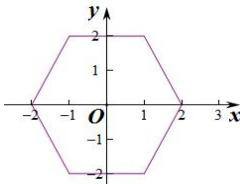

> [!faq]- 全练一本通解析
> **【答案】** 如图所示,面积为12
>
> **【解析】**
> 当 $x \geq 1$ 时， $|y|=4-2x$ ;
> 当 -1 ≤ x < 1 时，|y|=4；
> 当 $x \leq -1$ 时， $|y|=4+2x$ 作出图形如图：
> 
> 所以曲线围成的图像的面积为: $2 \times \frac{1}{2} \times (2 + 4) \times 2 = 12$ .
