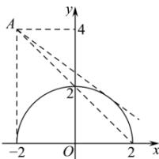

> [!faq]- 全练一本通解析
> **【解析】**
> 解析:由题可知, 直线 l 可转化为 $(x+2)k-y+4=0$ , 所以直线 l 恒过点 $A(-2,4)$ , 又因为曲线 $y=\sqrt{4-x^{2}}$ 可转化为 $x^{2}+y^{2}=4(y\geq0)$ , 则其表示圆心为原点, 半径为 2 的圆的上半部分,
> 当直线 l 与该曲线相切时, 点 $(0,0)$ 到直线的距离 $d=\frac{|4-2k|}{\sqrt{k^{2}+1}}=2$ , 解得 $k=-\frac{3}{4}$ .
> 设 $B(2,0)$ ，则 $k_{AB}=\frac{4-0}{-2-2}=-1$ 由图可得，若要使直线 $l: kx - y + 4 + 2k = 0$ 与曲线 $y = \sqrt{4 - x^{2}}$ 有两个交点，需要 $-1 \leq k < -\frac{3}{4}$ 即 $\left\{k\mid-1 \leq k < -\frac{3}{4}\right\}$
> 
