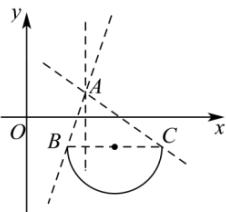

> [!faq]- 全练一本通解析
> **【答案】** B
>
> **【解析】**
> 解析： $l: kx - y - 2k + 1 = 0 \Rightarrow k(x - 2) - (y - 1) = 0$ ，所以直线恒过定点 $A(2,1)$ ，且斜率为k；
> 曲线 $C: y + 1 = -\sqrt{-x^{2} + 6x - 5}$ ，整理得 $(x - 3)^{2} + (y + 1)^{2} = 4$ ， $(y \leq -1)$ 故该曲线是以 $(3,-1)$ 为圆心，2为半径的下半圆，
> 如图所示，令 y=-1，代入 $(x-3)^{2}+(y+1)^{2}=4$ ，整理得 $(x-3)^{2}=4$ ，解得x=1或5；故 $B(-1,-1),C(5,-1)$ ，
> 
> $k_{AB}=\frac{1+1}{2-1}=2,k_{AC}=-\frac{2}{3}$ ，所以直线与曲线有交点，只需 $k\geq2$ 或 $k\leq-\frac{2}{3}$ 即可，故选：B.
