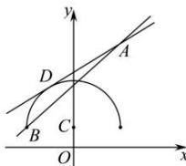

> [!faq]- 全练一本通解析
> **【解析】**
> $\left(\frac{5}{12},\frac{3}{4}\right]$ 解析：如图：
> 
> 化简曲线 $y = 1 + \sqrt{4 - x^2} (-2 \leq x \leq 2)$ 得： $x^2 + (y - 1)^2 = 4 (y \geq 1)$ .
> 曲线表示以 $C(0,1)$ 为圆心，半径 $r = 2$ 的圆的上半圆. $\because$ 直线 $y = k(x - 2) + 4$ 可化为 $y - 4 = k(x - 2)$ ，
> 直线经过定点 $A(2,4)$ 且斜率为 $k$ .
> 又 $\because$ 半圆 $y = 1 + \sqrt{4 - x^2} (-2 \leq x \leq 2)$ 与直线 $y = k(x - 2) + 4$ 有两个交点，设直线与半圆的切线为 $AD$ ，半圆的左端点为 $B(-2,1)$ ，当直线的斜率 $k$ 大于 $AD$ 的斜率且小于或等于 $AB$ 的斜率时，直线与半圆有两个相异的交点，由点到直线的距离公式，当直线与半圆相切时满足 $\frac{|-1 - 2k + 4|}{\sqrt{k^2 + 1}} = 2$ .
> 解之得 $k = \frac{5}{12}$ ，即 $k_{AD} = \frac{5}{12}$ 又因为直线 $AB$ 的斜率 $k_{AB} = \frac{3}{4}$ ，所以直线的斜率 $k$ 的范围为 $k \in \left(\frac{5}{12}, \frac{3}{4}\right]$ . 故答案为： $\left(\frac{5}{12}, \frac{3}{4}\right]$ .
