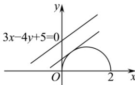

> [!faq]- 全练一本通解析
> **【答案】** B
>
> **【解析】**
> 解析：曲线 $y=\sqrt{-x^{2}+2x}$ ，其中 $-x^{2}+2x\geq0,\quad y\geq0$ ，即 $0\leq x\leq2,\quad y\geq0$ 曲线方程可化为 $(x-1)^{2}+y^{2}=1$ ，其中 $0 \leq x \leq 2, y \geq 0$ ，即曲线的轨迹是一个半圆.
> 因为圆心(1,0)到直线3x-4y+5=0的距离 $d=\frac{\left|3+5\right|}{\sqrt{3^{2}+4^{2}}}=\frac{8}{5}$ 故半圆上一点到直线的最小距离 $m_{\min}=d-r=\frac{3}{5}$ 半圆上点(2,0)到直线的距离最大 $m_{\max}=\frac{\left|6+5\right|}{\sqrt{3^{2}+4^{2}}}=\frac{11}{5}$ 则 m 的取值范围为 $\left[\frac{3}{5},\frac{11}{5}\right]$ ，故选：B.
> 
