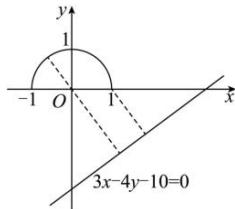

> [!faq]- 全练一本通解析
> **【解析】**
> $\left[\frac{7}{5},3\right]$
> 解析： $\sqrt{1-x^{2}}-y=0$ 即 $x^{2}+y^{2}=1(y\geq0)$
> 所以曲线 $\sqrt{1-x^{2}}-y=0$ 是圆心为 $(0,0)$ ，半径为 1 的圆的上半部分，如图，点 P 是曲线 $\sqrt{1-x^{2}}-y=0$ 上的动点，
> 
> 则点 $P$ 到直线 $3x - 4y - 10 = 0$ 距离的最大值为原点到直线距离加上圆的半径, 即 $\frac{10}{\sqrt{3^2 + 4^2}} + 1 = 3$ ,
> 点 $P$ 为 $(1,0)$ 时到直线 $3x - 4y - 10 = 0$ 的距离最小, 最小值为 $\frac{|3 - 10|}{\sqrt{3^2 + 4^2}} = \frac{7}{5}$ .
> 则点 $P$ 到直线 $3x - 4y - 10 = 0$ 距离的取值范围是 $\left[\frac{7}{5}, 3\right]$ .
> 故答案为: $\left[\frac{7}{5}, 3\right]$
