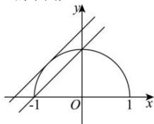

> [!faq]- 全练一本通解析
> **【答案】** C
>
> **【解析】**
> 解析:由曲线 $y=\sqrt{1-x^{2}}$ 得 $x^{2}+y^{2}=1(y\geq0)$ ，表示以原点为圆心，半径为1的半圆，
> 
> 当直线 $y=x+b$ 与半圆 $y=\sqrt{1-x^{2}}$ 相切时， $\frac{|b|}{\sqrt{2}}=1$ ，则 $b=\sqrt{2}$ ，
> 此时直线为 $y = x + \sqrt{2}$ ;
> 当直线 $y = x + b$ 过点 $(0,1)$ 时，b = 1，此时直线为 $y = x + 1$ ，
> 要使直线 $y = x + b$ 与曲线 $y = \sqrt{1 - x^{2}}$ 有两个交点，则 b 取值范围为 $[1, \sqrt{2})$ .
>
> 故选 **C**.
