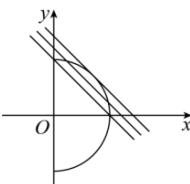

> [!faq]- 全练一本通解析
> **【答案】** D
>
> **【解析】**
> 解析: 由 $x=\sqrt{4-y^{2}}$ ，得 $x^{2}+y^{2}=4(x\geq0)$
> 
> 当直线 $l:y = -x + m$ 与 $x^{2} + y^{2} = 4(x\geq 0)$ 相切时， $m = 2\sqrt{2}$ 当直线 $l:y = -x + m$ 过点（0,2）时，有两个交点若直线 $l:y = -x + m$ 与曲线 $x = \sqrt{4 - y^2}$ 有两个公共点，则实数 $m$ 的取值范围是 $\left[2,2\sqrt{2}\right)$ .
>
> 故选 **D**.
