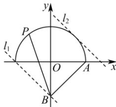

> [!faq]- 全练一本通解析
> **【答案】** D
>
> **【解析】**
> 解析: 因为 $y=\sqrt{1-x^{2}}$ ，即 $x^{2}+y^{2}=1(y\geq0)$ ，
> 则曲线 $y=\sqrt{1-x^{2}}$ 表示以坐标原点 O 为圆心，半径为 1 的上半圆，并记为 C，
> 设点 $P(x,y)$ ，则 $\overrightarrow{BP}=(x,y+1),\overrightarrow{BA}=(1,1)$ ，
> 所以 $\overrightarrow{BP}\cdot\overrightarrow{BA}=x+y+1$ ，令 $t=x+y+1$ ，则 $y=-x+t-1$ ，
> 故直线 $y=-x+t-1$ （斜率为 -1，纵截距为 t-1）与曲线 C 有公共点，
> 如图所示：
> 
> 直线 $l_{1}: y = -x + m$ 过点 $D(-1,0)$ ，则 $0 = 1 + m$ ，即 m = -1，
> 直线 $l_{2}: y = -x + n$ 与曲线 C 相切，则 $\frac{|n|}{\sqrt{1^{2} + 1^{2}}} = 1$ ，解得 $n = \sqrt{2}$ 或 $n = -\sqrt{2}$ （舍去），
> 所以 $-1 \leq t - 1 \leq \sqrt{2}$ ，则 $0 \leq t \leq \sqrt{2} + 1$ ，所以 $\overrightarrow{BP} \cdot \overrightarrow{BA}$ 的最大值为 $\sqrt{2} + 1$ .
>
> 故选 **D**.
