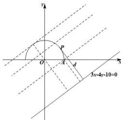

> [!faq]- 全练一本通解析
> **【答案】** D
>
> **【解析】**
> 解析:由 $\sqrt{1-x^{2}}-y=0$ 可得 $y=\sqrt{1-x^{2}}$ ，则 $y\geq0$ ，在等式 $y=\sqrt{1-x^{2}}$ 两边平方并整理得 $x^{2}+y^{2}=1$ ，
> 所以，曲线 $\sqrt{1-x^{2}}-y=0$ 为圆 $x^{2}+y^{2}=1$ 的上半圆，该圆的半径为 r=1，
> 作出曲线 $\sqrt{1-x^{2}}-y=0$ 与直线 3x-4y-10=0 的图象如下图所示：
> 
> 原点 O 到直线 3x-4y-10=0 的距离为 $\frac{10}{\sqrt{3^{2}+(-4)^{2}}} = 2$ ,
> 设点 P 到直线 3x-4y-10=0 的距离为 d，
> 当点 P 的坐标为 $(1,0)$ ，d 取最小值，即 $d_{\min}=\frac{\left|3\times1-4\times0-10\right|}{\sqrt{3^{2}+\left(-4\right)^{2}}}=\frac{7}{5}$ 由图象可知， $d_{\max}=2+r=2+1=3$ 因此，点 P 到直线 3x-4y-10=0 的距离的取值范围是 $\left[\frac{7}{5},3\right]$ .
>
> 故选 **D**.
