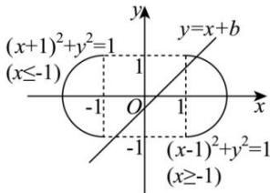

> [!faq]- 全练一本通解析
> **【答案】** $(-1 - \sqrt{2}, -2] \cup \{0\} \cup [2, 1 + \sqrt{2})$
>
> **【解析】**
> 依题意, $-1 \leq y \leq 1$ , $0 \leq |x| - 1 \leq 1$ , 即 $-2 \leq x \leq -1$ 或 $1 \leq x \leq 2$ , 当 $-2 \leq x \leq -1$ 时, 曲线方程 $(x + 1)^2 + y^2 = 1$ 表示在直线 $x = -1$ 及左侧半圆, 圆心为 $(-1,0)$ , 半径为 1, 当 $1 \leq x \leq 2$ 时, 曲线方程 $(x - 1)^2 + y^2 = 1$ 表示在直线 $x = 1$ 及右侧半圆, 圆心为 $(1,0)$ , 半径为 1, 曲线 $\sqrt{1 - y^2} = |x| - 1$ 与直线 $y = x + b$ 有两个不同的交点, 等价于上述两个半圆组成的图形与直线 $y = x + b$ 有两个不同的交点, 在同一坐标系内作出曲线 $\sqrt{1 - y^2} = |x| - 1$ 与直线 $y = x + b$ , 如图,
> 
> 当直线 $y=x+b$ 与半圆 $(x+1)^{2}+y^{2}=1(-2\leq x\leq-1)$ 相切时， $\left\{\begin{aligned}\frac{|-1+b|}{\sqrt{2}}=1,\\b>1\end{aligned}\right.$ 解得 $b=1+\sqrt{2}$ ，
> 当直线 $y=x+b$ 过点 $(-1,-1)$ 时，b=2，由图形得当 $2\leq b<1+\sqrt{2}$ 时，直线 $y=x+b$ 与这个半圆有两个交点，
> 当直线 $y=x+b$ 过点 $(-1,-1)$ 时，b=0，这条直线也过点 $(1,1)$ ，符合题意，
> 当直线 $y=x+b$ 与半圆 $(x-1)^{2}+y^{2}=1(1\leq x\leq2)$ 相切时， $\left\{\begin{aligned}\frac{|1+b|}{\sqrt{2}}=1,\\b<-1\end{aligned}\right.$ ，解得 $b=-1-\sqrt{2}$ 当直线 $y=x+b$ 过点 $(1,-1)$ 时，b=-2，由图形得当 $-1-\sqrt{2}<b\leq-2$ 时，
> 直线 $y=x+b$ 与这个半圆有两个交点，
> 所以实数 b 的取值范围是 $(-1-\sqrt{2},-2]\cup\{0\}\cup[2,1+\sqrt{2})$ .
> 故答案为： $(-1-\sqrt{2},-2]\cup\{0\}\cup[2,1+\sqrt{2})$
