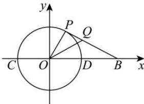

<!-- question-source:start -->
【47】(2024·全国高二专题) 如图, 已知点 B 的坐标为 $(2,0)$ , P 是以点 O 为圆心的单位圆上的动点（不与点 C, D 重合）， $\angle POB$ 的角平分线交直线 PB 于点 Q，求点 Q 的轨迹方程.

<!-- question-source:end -->

![[Q00007382A1]]
