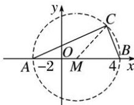

> [!faq]- 全练一本通解析
> **【解析】**
> $(x-1)^{2}+y^{2}=9$ （ $y\neq0$ ）.
> 解析: 设 $C(x,y)$ ，由于直角三角形斜边上的中点为 $M(1,0)$ ，如图所示，
> 
> 则半径为 $\frac{1}{2} |AB| = \frac{1}{2}\sqrt{(4 + 2)^2 + (0 - 0)^2} = 3$
> 即得圆的方程为 $(x-1)^{2}+y^{2}=9$ .
> 但是顶点 C 不能在直线 AB 上, 因此 $y \neq 0$ ,
> 因此 $C$ 点满足的方程为 $\left(x - 1\right)^2 +y^2 = 9$ （ $y\neq 0$ ）
> 故答案为: $(x-1)^{2}+y^{2}=9\quad(y\neq0)$
