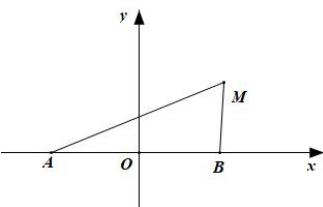

> [!faq]- 全练一本通解析
> **【解析】**
> $x^{2} + y^{2} = 4$
> 解析:以两个定点的中点为原点,建立如图所示的平面直角坐标系.
> 
> 则 $A(-3,0)$ ， $B(3,0)$ ，设 $M(x,y)$ ，
> 则 $\left|MA\right|^{2}+\left|MB\right|^{2}=26,\therefore\left(x+3\right)^{2}+y^{2}+\left(x-3\right)^{2}+y^{2}=26$ 化简得 M 点的轨迹方程为 $x^{2}+y^{2}=4$ .
