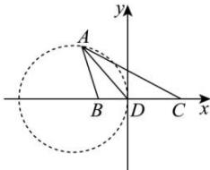

> [!faq]- 全练一本通解析
> **【解析】**
> 3
> 解析: 因为角 A 的平分线交 BC 于点 D，则 $\angle BAD = \angle CAD$ ，故 $\frac{AB}{BD} = \frac{AC}{DC}$ ，则 $\frac{AB}{AC} = \frac{BD}{DC} = \frac{1}{2}$ .
> 以 D 为坐标原点建立如图平面直角坐标系，
> 
> 因为 $BC = 3, \frac{BD}{DC} = \frac{1}{2}$ ，故 $B(-1,0), C(2,0)$ ，设 $A(x,y)$ ，
> 则 $\frac{(x+1)^{2}+y^{2}}{(x-2)^{2}+y^{2}}=\frac{1}{4}$ ，化简可得 $x^{2}+4x+y^{2}=0$ ，即 $(x+2)^{2}+y^{2}=4$ $(y\neq0)$ .
